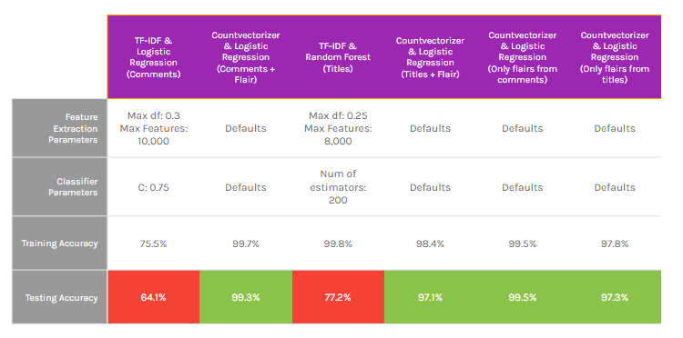

#  Project 3: Web APIs & NLP

### Problem Statement

Reddit is a social media website with the added benefit of finding those with similar interests. Afterall, there is a subreddit for everything. When posting, it can be difficult to know which subreddit to post to because they can get very specific. In this project, a classification model will be built to predict which subreddit a comment/post came from. This can be used when comments may be taken out of context or if somebody wants to choose the correct subreddit to post on. In this case it can be used to show whether or not the post/comment was meme related.

### Background (From [GA Project Prompt](https://git.generalassemb.ly/DSIR-523/project-3))

Your goal is two-fold:
1. Using [Pushshift's](https://github.com/pushshift/api) API, you'll collect posts from two subreddits of your choosing.
2. You'll then use NLP to train a classifier on which subreddit a given post came from. This is a binary classification problem.

* Chosen subreddits are: r/formula1 and r/formuladank
* Used PMAW instead of just pushshift [Source](https://medium.com/swlh/how-to-scrape-large-amounts-of-reddit-data-using-pushshift-1d33bde9286) and [pmaw Documentation](https://pypi.org/project/pmaw/)

### Datasets

* [`subreddit_comments.csv`](./data/subreddit_comments.csv): Comment Data: Includes both subreddits
* [`subreddit_titles.csv`](./data/subreddit_titles.csv): Title Data: Includes both subreddits

### Data Dictionary

|Feature|Type|Dataset|Description|
|---|---|---|---|
|subreddit|object|Comments & Titles|Subreddit where the data originated from|
|body|object|Comments|Comment text|
|title|object|Titles|Title text|
|author_flair_text|object|Comments & Titles|Flair text for the user who submitted the post or comment|

### Summary of Analysis

Begin with top words used in comments and titles (with stop words removed)

This shows that the formula1 subreddit generally utilizes the same words more in both titles and comments. There is also some variation in the proportions of these words relative to each subreddit, which should allow us to build a decent model. 

4 different models were built, and they will all be compared to the baseline. In this case, the baseline is 50% because the same amount of data was pulled from each subreddit.

Each model was put through a grid search to find the best hyperparameters.

There were 2 models each for both comments and titles, one including user flair as a feature, and one without. The user flair was added as an additional feature to help guide the model in a significant way, as shown below: 

There is a drastic difference in test accuracy when comparing the models with user flairs as a feature to those without (20-30%). This is because the flairs are quite unique to each subreddit. The other notable value is the random forest model's training accuracy. Random forests are notoriously overfit, however, the random forest model resulted in the highest test accuracy for the data so it was chosen in that case. 

Using only flairs, we actually achieved a higher accuracy than when adding text from the comments and titles. This indicates that it is definitely the best indicator of which subreddit a post came from. The most common flair was no flair, accounting for around 18% of the data. No flair was also much more common among the formula1 subreddit as opposed to formuladank. 

We do not care in this case about metrics other than accuracy as misclassification one way or the other generally is not relevant. Below are the confusion matrices:

### Conclusions and Recommendations

Overall, the performance of the model using comments and flairs was the most accurate model, as well as the best fit model. It is ever so slightly overfit, although 0.4% is not that significant of a margin. When given the user's flair text, the models perform very well because of the uniqueness to each subreddit. Without the flairs, the model performs quite poorly, being overfit and inaccurate. It was still better than the baseline, however. 

Next Steps:

* Dive deeper into grid searching with flairs as a feature
* Model other similar subreddit pairs 
* Find other interesting features to use (similar to flairs)
